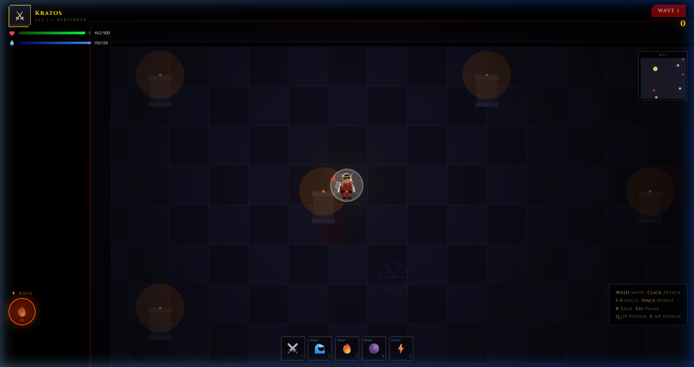
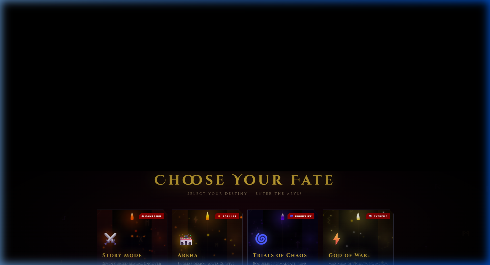
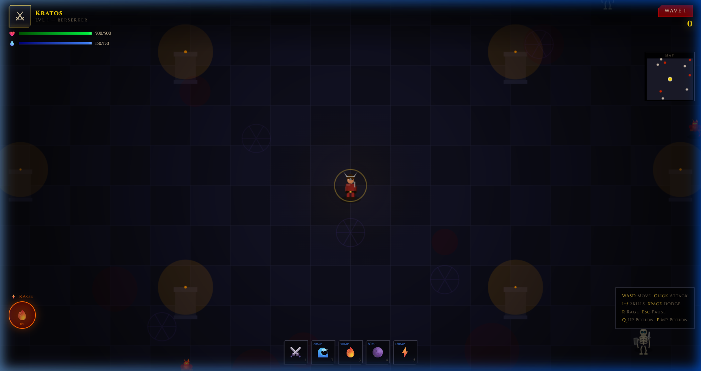
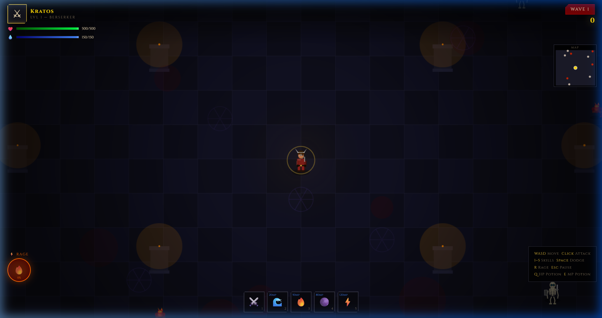

<div align="center">



# ⚔️ INFERNUS — Rise of the Damned

### *A dark fantasy dungeon survival game. Fight waves of demons, level up, master skills, and conquer the abyss.*

[](https://nodejs.org)
[](https://expressjs.com)
[](https://sqlite.org)
[](#)
[](#)

</div>

---

## 🎮 Screenshots

<table>
  <tr>
    <td><br><sub><b>Mode Selection</b></sub></td>
    <td><br><sub><b>Arena Combat</b></sub></td>
  </tr>
  <tr>
    <td><br><sub><b>Intense Battle</b></sub></td>
    <td><br><sub><b>Boss Encounter</b></sub></td>
  </tr>
</table>

---

## ✨ Features

### 🗡️ Combat System
- **Real-time action combat** — click to attack, aim with your mouse
- **Dodge roll** with invincibility frames
- **Rage Mode** — fills as you fight, unleash a 2.5× damage frenzy
- **5 unique skills** per character (Wave Slash, Firestorm, Dark Nova, Chain Lightning, Death Mark)
- **Combo multiplier** — chain kills to earn bonus gold and XP

### 🧙 5 Playable Characters
| Character | Class | Specialty |
|-----------|-------|-----------|
| ⚔️ Kratos | Berserker | Brute force, high HP |
| 🏹 Lyria | Ranger | Speed + critical shots |
| 🔮 Malachar | Warlock | Mana-fueled arcane burst |
| 🛡️ Gareth | Paladin | Defense + lifesteal |
| 💀 Seraph | Reaper | Crit + dark magic |

### 🗺️ 4 Game Modes
| Mode | Difficulty | Description |
|------|-----------|-------------|
| 📖 **Story** | Normal | Boosted HP, reduced ATK — narrative campaign |
| ⚔️ **Arena** | Standard | Classic wave survival |
| 🌀 **Trials of Chaos** | Hard | Harder enemies, faster scaling |
| 👁️ **God of War** | Extreme | Half HP, enemies hit like trucks |

### 🏪 Full Item Shop
- Weapons, Armor, Accessories across 3 equipment tabs
- Gold earned in-game, persisted between sessions
- Stat modifiers: ATK, DEF, HP, Crit bonuses

### 🌟 Progression System
- **Level up** — gain stats after every wave
- **XP & Gold** persist between sessions (cloud-saved)
- **Rune system** — unlock passive buffs (lifesteal, cooldown reduction, etc.)
- **11 Achievements** to unlock
- **Progress screen** — kill count, boss kills, best combo, best score

### 📱 Mobile & Desktop Support
- **Full touch controls** — virtual joystick + on-screen action buttons
- Responsive UI on all screen sizes (phones, tablets, desktops)
- Touch devices skip straight to gameplay — no friction

---

## 🚀 Getting Started

### Prerequisites
- [Node.js](https://nodejs.org) v18 or higher
- npm (comes with Node.js)

### Installation

```bash
# 1. Clone or download the project
git clone <your-repo-url>
cd "INFERNUS The Dungeon Game"

# 2. Install dependencies
npm install

# 3. Start the server
npm start
```

### Play
Open your browser and go to:
```
http://localhost:3000
```

> Works on any modern browser — Chrome, Firefox, Edge, Safari.  
> On **mobile**, open the same URL on your phone (must be on the same Wi-Fi network, or deploy online).

---

## 🎮 Controls

### Desktop
| Action | Control |
|--------|---------|
| Move | `W A S D` or Arrow Keys |
| Attack | Left Click (hold to rapid-fire) |
| Dodge Roll | `Space` or Right Click |
| Rage Mode | `R` |
| HP Potion | `Q` |
| MP Potion | `E` |
| Skills | `1` `2` `3` `4` `5` |
| Pause | `Escape` |

### Mobile (Touch)
| Action | Control |
|--------|---------|
| Move | Left virtual joystick |
| Attack | ⚔ ATK button (hold = rapid-fire) |
| Dodge | 💨 DODGE button |
| Rage | 🔥 RAGE button (glows when ready) |
| Potions | ❤️ HP / 💧 MP buttons |
| Skills | Skill row buttons (1–5) |
| Pause | ⏸ top-right corner |

---

## 🏗️ Project Structure

```
INFERNUS The Dungeon Game/
│
├── public/
│   └── index.html          # Entire game — HTML + CSS + JS (single file)
│
├── screenshots/            # Game screenshots
│
├── server.js               # Express backend (auth, save/load API)
├── database.sqlite         # Player accounts & cloud saves (auto-created)
├── package.json
└── README.md
```

---

## 🔧 Tech Stack

| Layer | Technology |
|-------|-----------|
| **Game Engine** | Vanilla JavaScript (Canvas 2D API) |
| **UI / Styling** | HTML5 + Vanilla CSS (no frameworks) |
| **Backend** | Node.js + Express 5 |
| **Database** | **Supabase (PostgreSQL Cloud)** / SQLite (fallback) |
| **Auth** | JWT (JSON Web Tokens) + bcrypt |
| **Audio** | Web Audio API (generative music + SFX) |
| **Rendering** | HTML5 Canvas — 60 FPS game loop |

---

## ⚡ Supabase Cloud Database Setup

To persist player accounts, stats, weapons, runes, achievements, and records in the cloud:

1. Create a project at [supabase.com](https://supabase.com).
2. Open **SQL Editor** in your Supabase dashboard and run:
   ```sql
   CREATE TABLE IF NOT EXISTS users (
       id BIGINT GENERATED BY DEFAULT AS IDENTITY PRIMARY KEY,
       username TEXT UNIQUE NOT NULL,
       password TEXT NOT NULL,
       game_data JSONB DEFAULT '{}'::jsonb,
       created_at TIMESTAMPTZ DEFAULT NOW(),
       updated_at TIMESTAMPTZ DEFAULT NOW()
   );

   CREATE INDEX IF NOT EXISTS idx_users_username ON users(username);
   ```
3. Copy your project credentials from **Project Settings ➔ API**:
   - `Project URL`
   - `service_role` key (recommended) or `anon public` key
4. Add them to your `.env` file (locally) or platform environment variables (Netlify / Railway / Render):
   ```env
   PORT=3000
   SECRET_KEY=your_custom_jwt_secret
   SUPABASE_URL=https://your-project.supabase.co
   SUPABASE_KEY=your-supabase-key
   ```

---

## 🎵 Audio System

INFERNUS uses a fully **generative audio engine** built on the Web Audio API:
- **Dungeon ambience** — procedural low-frequency drone with reverb
- **Combat music** — dynamic layered percussion that kicks in during battles
- **SFX** — synthesized sword slashes, dodge whooshes, magic impacts, enemy deaths
- No audio files needed — everything is generated in real time

---

## ⚙️ Configuration

Edit `server.js` to change:

```js
const PORT = process.env.PORT || 3000;           // Server port
const SECRET_KEY = 'your-secret-key-here';       // JWT secret (change in production!)
```

---

## 📜 License

MIT — free to use, modify, and distribute.

---

<div align="center">

**⚔️ Built with blood, fire, and JavaScript. ⚔️**

*Enter the dungeon. Survive the abyss. Rise.*

</div>
